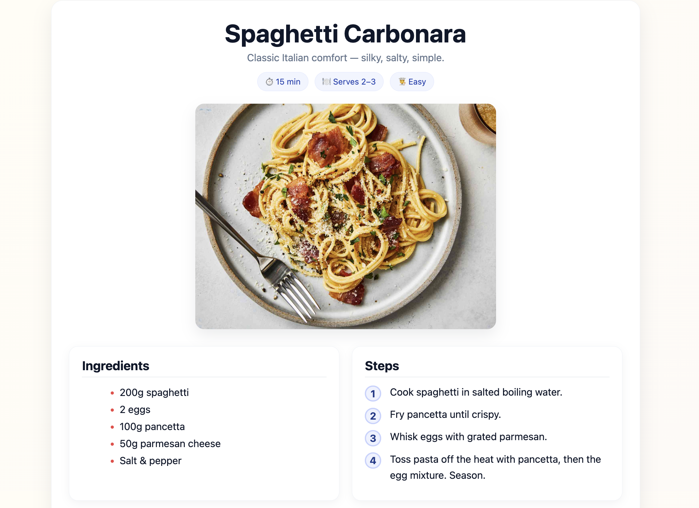

# Week 01–02 – Hello World & Recipe Site

## 📌 Overview
These two weeks focused on:
- Learning the basics of **Git/GitHub workflow**
- Building a first static webpage with **HTML + CSS**

---

## 🗂 Part 1: Hello World (Week 01)

### 📖 What I did
- Created a weekly homework folder
- Added a simple text file `hello.txt`
- Practiced `git add`, `git commit`, and `git push`

### 📂 Project Structure
```text
Homework/week01-02/
├── hello.txt
└── README.md
```

## 🍝 Part 2: Recipe Site (Week 02)

### 📖 What I did
	· Built a recipe page for Spaghetti Carbonara
	· Used semantic HTML (<h1>, <ul>, <ol>, )
	· Styled with modern CSS (card layout, responsive grid, soft background)
	· Placed Ingredients and Steps side by side in two panels

### 📂 Project Structure
```text
Homework/week01-02/recipe-site/
├── index.html
├── style.css
└── images/
    ├── carbonara.jpg
    └── screenshot.png
```

### ▶️ How to View
	1.	Open recipe-site/index.html directly in a web browser
	2.	Or deploy via GitHub Pages / Vercel for live preview

### 📸 Screenshot


### ✅ Summary
	· Week01: Learned Git basics and pushed first file
	· Week02: Designed a recipe card webpage with clean styling and responsive layout