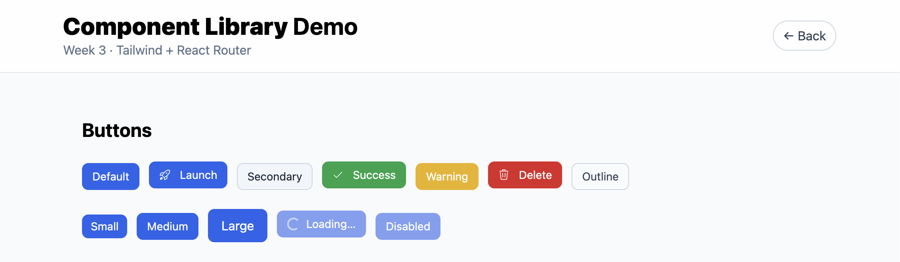
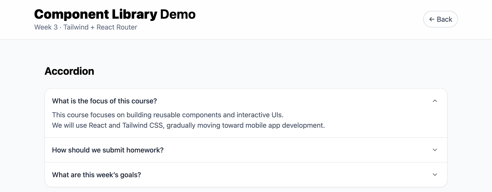

# Week3_Component Library (Buttons & Accordion)

## 📌 Overview
Build a small component library with **React + Vite + Tailwind CSS**, and organize demo pages with **React Router**.

---

## 🎨 Features
1. **Button Component**
   - Variants: primary, secondary, success, warning, danger, outline  
   - Sizes: sm, md, lg  
   - States: disabled, loading  
   - Pill (rounded-full) option  
   - Optional icons (react-icons)

2. **Accordion Component**
   - Expand/collapse panels with smooth animation  
   - Chevron icon rotates on toggle  
   - Typography via `@tailwindcss/typography` (prose)  
   - English content, supports paragraphs/lists/code

3. **Routing**
   - `/buttons` – showcase all Button variants & states  
   - `/accordion` – accordion demo with prose content

---

## 📂 Project Structure
```text
Homework/week03/my-app/
├── src/
│   ├── components/      # Button.jsx, Accordion.jsx
│   ├── pages/           # ButtonsPage.jsx, AccordionPage.jsx
│   ├── main.jsx         # Router + layout
│   └── index.css        # Tailwind directives
├── index.html
├── tailwind.config.js
├── postcss.config.js
└── package.json
```

## ▶️ How to Run
1.	Go to the Week03 app:
```
 cd Homework/week03/my-app
```

2.	Install dependencies:
```
 npm install
```

3.	Start the dev server:
```
 npm run dev
```
4.	Open the local URL printed in terminal (usually http://localhost:5173).

## 🔗 Live Demo

```
https://dynamic-web-class-notes.vercel.app/
```

## 📸 Screenshots




## ✅ Summary
- Built reusable UI components (Button, Accordion) with Tailwind utility classes
- Added routing to present components on dedicated pages
- Enhanced readability with @tailwindcss/typography