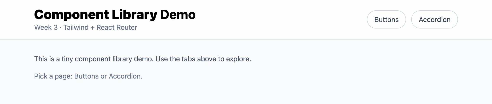

# Week 03 – Component Library (Buttons + Accordion)

## 🚀 Overview
This week’s assignment focuses on building a small component library using **React + Tailwind CSS**.  
The main tasks were:
- Create a reusable `<Button />` component with multiple variants and states.
- Implement an `<Accordion />` component with expand/collapse functionality.
- Use **React Router** to organize pages (`/buttons` and `/accordion`).

---

## 📂 Project Structure
Week03/
└─ my-app/
   ├─ src/
   │  ├─ components/        # Button + Accordion components
   │  ├─ pages/             # ButtonsPage + AccordionPage
   │  └─ main.jsx           # Router + Layout
   ├─ index.html
   ├─ tailwind.config.js
   ├─ package.json
   └─ README.md

---

## 🛠️ How to Run
1. Clone this repo and navigate into the Week03 project:
   ```bash
   cd Week03/my-app

2.	Install dependencies:   
    npm install

3.	Start the dev server:
    npm run dev

4.	Open the local server link in your browser (usually http://localhost:5173).

## 🎨 Features

1. Button Component
	· Variants: primary, secondary, success, warning, danger, outline
	· Sizes: sm, md, lg
	· States: disabled, loading
	· pill option for fully rounded buttons
	· Supports icons via react-icons

2. Accordion Component
	· Expand/collapse panels with smooth animation
	· Chevron icon rotates on toggle
	· Typography enhanced with @tailwindcss/typography (prose styles)
	· Supports rich content: paragraphs, lists, code blocks

3. Routing
	· /buttons: Demonstrates all Button variants and states
	· /accordion: Demonstrates Accordion with English content + typography

## 📸 Screenshots

### Home page


### Buttons page


### Accordion Page
