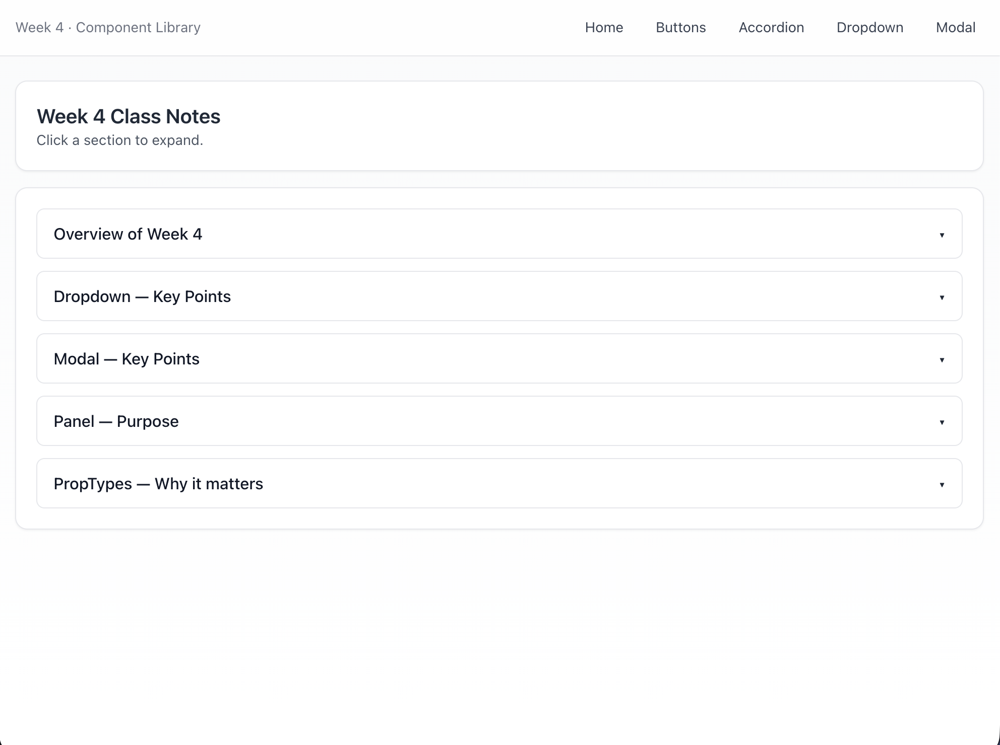
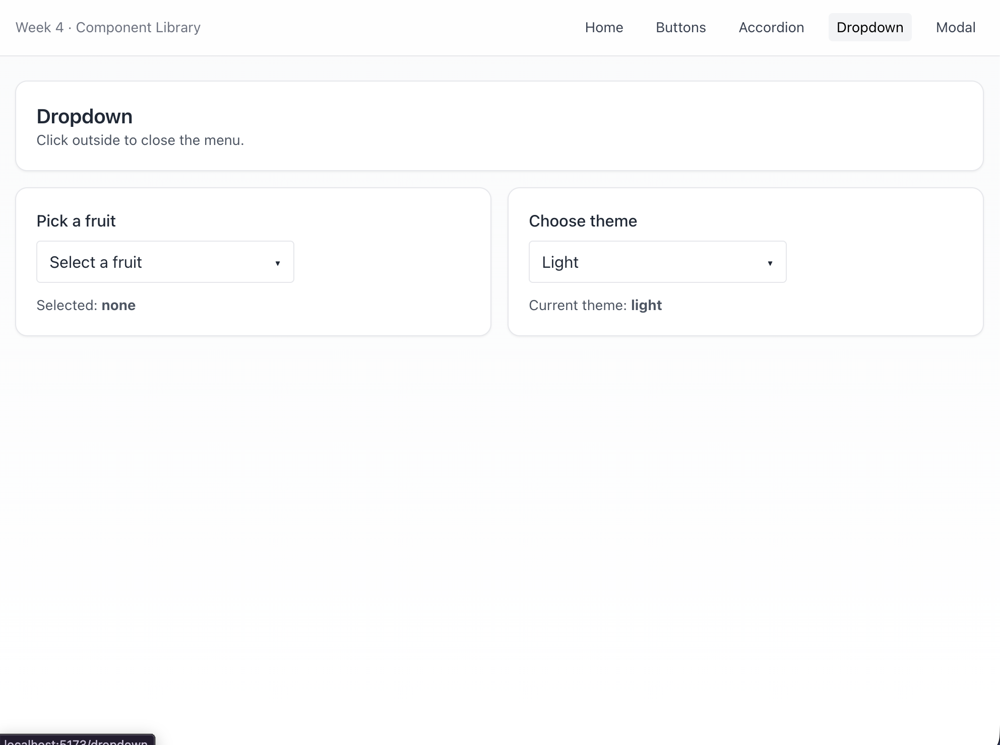
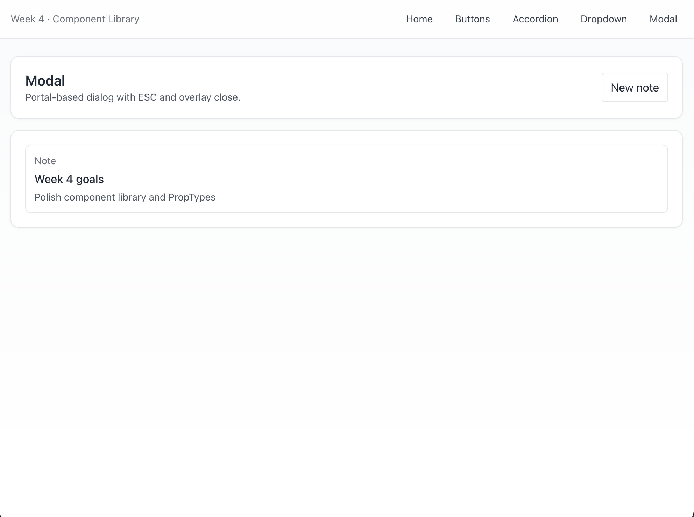
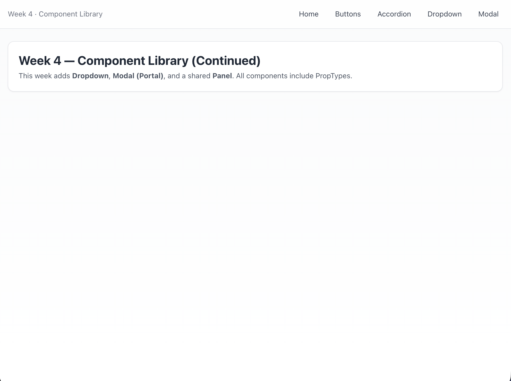

# Week4_Component Library (Dropdown, Modal & Panel)

## 📌 Overview
Extend the component library built with React + Vite + Tailwind CSS by adding more reusable UI elements and organizing them into dedicated demo pages with React Router.
This week builds directly on Week3, with new components and improved structure.
---

## 🎨 Features
1. **Dropdown Component**
   - Controlled state with useState
   - Closes on outside click
	- Highlights selected option
	- Supports disabled items
2.	**Modal Component**
	- Implemented with React Portal (#modal-root)
	- Overlay click to close
	- ESC key to close
	- Accessible with focus trap and ARIA attributes
3.	**Panel Component**
	- Shared container with border, padding, rounded corners
	- Provides consistent layout styling across pages
4.	**PropTypes Validation**
	- All components use PropTypes for runtime prop checking
	- Helps surface invalid usage early during development
5.	**Routing**
	- /accordion – recap from Week3 with improved layout
	- /dropdown – dropdown demo with multiple option sets
	- /modal – modal demo with note-taking example

---

## 📂 Project Structure
```text
Homework/week04/my-app/
├── src/
│   ├── components/      # Dropdown.jsx, Modal.jsx, Panel.jsx, Accordion.jsx
│   ├── pages/           # AccordionPage.jsx, DropdownPage.jsx, ModalPage.jsx
│   ├── App.jsx          # Navbar + routes
│   ├── main.jsx         # React entry point
│   └── index.css        # Tailwind directives
├── index.html           # root + modal-root
├── tailwind.config.js
├── postcss.config.js
└── package.json
```

## ▶️ How to Run
1.	Go to the Week03 app:
```
 cd Homework/week04/my-app
```

2.	Install dependencies:
```
 npm install
```

3.	Start the dev server:
```
 npm run dev
```
4.	Open the local URL printed in terminal (usually http://localhost:5173).

## 🔗 Live Demo

```
。。。
```

## 📸 Screenshots






## ✅ Summary
- Added Dropdown, Modal, and Panel to extend the component library
- Improved structure with consistent containers and navigation
- Integrated PropTypes for runtime prop validation
- Used React Router to organize demos into separate pages