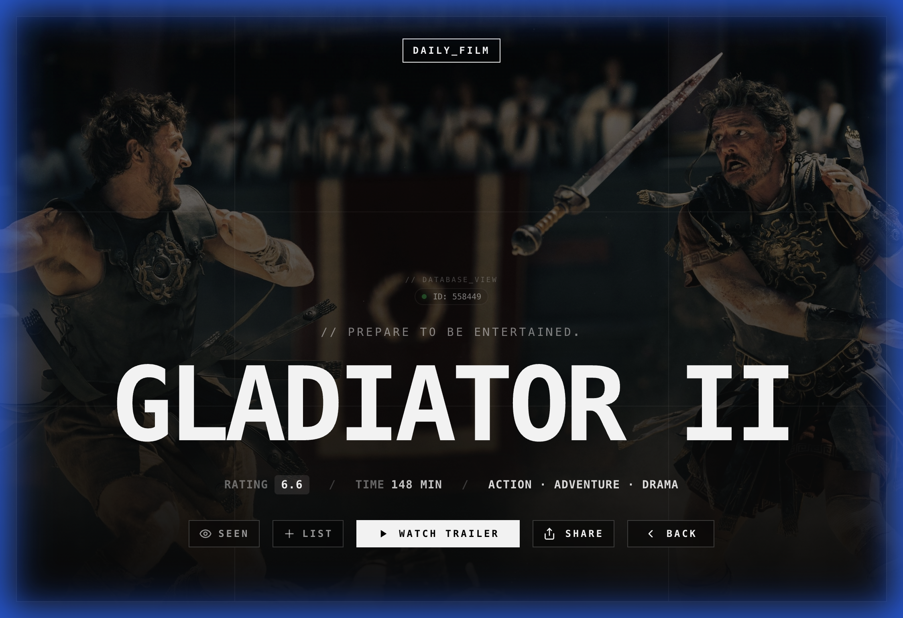
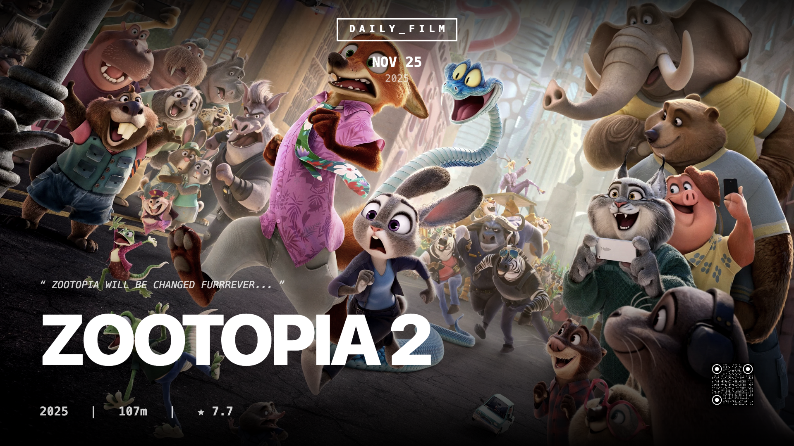

# DAILY FILM

[](https://daily-film.vercel.app/)
[](https://react.dev/)
[](https://vitejs.dev/)

**DAILY FILM** is a cinematic discovery platform designed to combat choice paralysis. It offers **one single, curated film per day**, selected through a deterministic algorithm.

> "The antidote to algorithmic fatigue."

---

## Interface Preview

<div align="center">
  
  <p><em>Main Interface: The Daily Curated Cinema Experience</em></p>
</div>

<br/>

<div align="center">
  
  <p><em>Movie Context: Adaptive Hero Layout & Key Metrics</em></p>
</div>

<br/>

<div align="center">
  
  <p><em>Social Share Interface: High-Fidelity Poster Rendering</em></p>
</div>

---

## Key Features

### Deterministic Recommendation System
A client-side algorithm (`src/services/recommendationEngine.js`) uses the current date as a seed to generate recommendations. This ensures consistent "Film of the Day" selection across all global users without needing a backend database.

### Industrial UI/UX Design
The interface adopts an "Industrial Dossier" aesthetic featuring:
*   **Data Cards**: Interactive containers with hover states.
*   **Kinetic Typography**: Typewriter-style text rendering for reviews.
*   **Data Visualization**: Visual representations of financial and audience metrics.

### Navigation State Management
Uses a "Stale-While-Revalidate" approach to transitions. The previous UI state persists until new data resolves, eliminating screen flicker and providing a smoother user experience.

---

## Architecture

*   **Core**: React 19, Vite, TypeScript
*   **Styling**: Tailwind CSS
*   **Animation**: Framer Motion
*   **Data Source**: TMDB API
*   **Deployment**: Vercel

```text
src/
├── components/         # Reusable UI atoms
├── config/             # Configuration files
├── hooks/              # Custom React hooks
├── pages/              # Route views
└── services/           # Business logic
```

---

## Development Setup

1.  **Install dependencies:**
    ```bash
    npm install
    ```
2.  **Start the development server:**
    ```bash
    npm run dev
    ```
3.  **Open the application:**
    `http://localhost:5173`

---

## Version History

### v3.0.0 (FINAL)
*   **Cinematic Dossier**: Redesigned analysis section with grid layout.
*   **Financial Metrics**: Added budget, revenue, and ROI data.
*   **Sidebar Updates**: Focused on Director and Cast information.
*   **Visual Persistence**: Fixed navigation flickering.

### v2.0.0
*   **Canvas Engine**: Added browser-native asset generation.
*   **Visual Atmosphere**: Implemented lighting calibration and noise overlays.
*   **Time Sync**: Localized recommendation locking.

### v1.0.0
*   **Architecture**: Initial setup with React and Vite.
*   **Security**: API key protection.
*   **PWA**: Manifest configuration.

---

*Data provided by The Movie Database (TMDb).*
*Lead Engineer: Gavin Zhang | Fall 2025*
