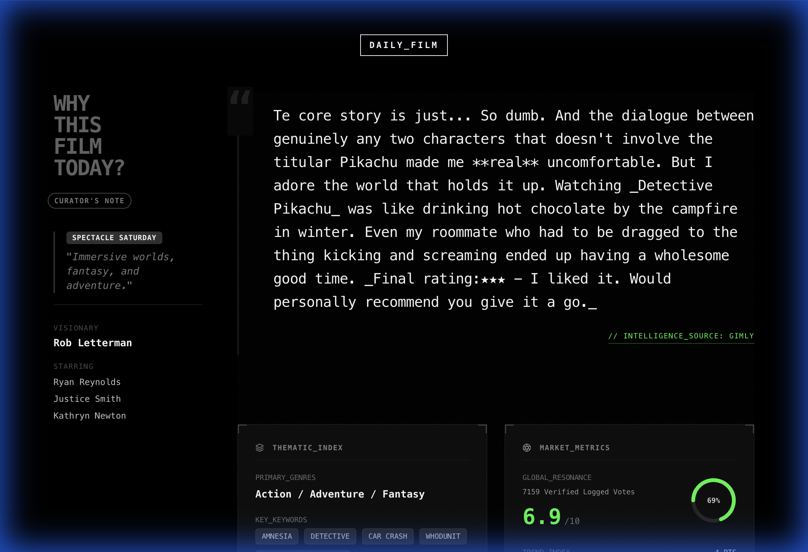

# DAILY FILM

[](https://daily-film.vercel.app/)
[](https://react.dev/)
[](https://vitejs.dev/)

**DAILY FILM** is a cinematic discovery platform with a rigorous industrial aesthetic. It stands against the "choice paralysis" of modern streaming by offering **one single, curated film per day**.

> "The antidote to algorithmic fatigue."

---

## 📸 Visual Showcase

<div align="center">
  
  <p><em>The v3.0 Dossier Interface: Industrial Grids & Real-Time Intelligence</em></p>
</div>

<br/>

<div align="center">
  
  <p><em>Detail View: Native Canvas-Generated Posters & Contextual Metadata</em></p>
</div>

---

## ⚡️ Key Engineering Features

### 1. No-Database Recommendation Engine
A deterministic algorithm (`src/services/recommendationEngine.js`) uses the current date as a random seed. This ensures every user globally sees the exact same "Film of the Day" without requiring a centralized backend database.

### 2. Cinematic Dossier Interface (v3.0)
The "Why" section features a classified military aesthetic:
*   **Industrial Data Cards**: Corner-bracketed containers with scan-line hover effects.
*   **Phantom Typewriter**: A kinetic typography engine that types out reviews without layout shifts.
*   **Real-Time Intelligence**: Dynamic SVG gauges and sparklines visualizing financial and audience metrics.

### 3. Visual Persistence System
Implemented a "Stale-While-Revalidate" strategy that prevents black-screen flashes during navigation. The UI holds the previous state until the new data is fully resolved, creating a seamless, app-like feel.

---

## 🛠 Project Architecture

*   **Core**: React 19, Vite, TypeScript
*   **Styling**: Tailwind CSS (Custom "Industrial" Config)
*   **Animation**: Framer Motion (Page transitions, Micro-interactions)
*   **Data Source**: TMDB API (The Movie Database)
*   **Deployment**: Vercel (Serverless Proxy for API security)

```
src/
├── components/         # Reusable UI atoms (AnalysisGrid, DailyContextSidebar)
├── config/             # Strategic configuration (Curation Rules)
├── hooks/              # Custom logic (useMovies, useScrollRestoration)
├── pages/              # Route views (Home, MovieDetail, About)
└── services/           # Business logic (Recommendation Engine)
```

---

## 🚀 Quick Start

1.  **Install dependencies:**
    ```bash
    npm install
    ```
2.  **Start the development server:**
    ```bash
    npm run dev
    ```
3.  **Open the application:**
    `http://localhost:5173`

---

## 📜 Engineering Release Log

### v3.0.0 (FINAL): The "Immersion" Update
*Focus: Deep Interaction & Visual Intelligence*
*   **Cinematic Dossier**: Full redesign of the analysis section into a "Classified Intel" format with industrial grids and kinetic type.
*   **Financial Intelligence**: Integrated real-time Budget, Revenue, and ROI metrics to provide high-value context.
*   **Creative Context**: Shifted sidebar focus from generic stats to "Visionary" (Director) and "Starring" (Cast) billing.
*   **Visual Persistence**: Solved navigation "blinking" by persisting stale UI states during data fetches.

### v2.0.0: The "Aesthetic" Update
*Focus: Atmosphere & Core Engines*
*   **Native Canvas Engine**: Browser-native generation of sharable social assets (Posters/Stories) without cross-origin tainting.
*   **Atmosphere System**: "Let the Light In" lighting calibration and grainy noise overlays for texture.
*   **Global Time Sync**: Solved the "Tomorrow's Movie" timezone leak by locking recommendations to local client time.

### v1.0.0: The "Foundation"
*Focus: Architecture & Security*
*   **Hybrid Proxy**: Dual-strategy API proxy (Serverless/Middleware) to secure TMDB keys.
*   **Edge Caching**: Redis-backed caching for high-volume API requests.
*   **PWA Readiness**: Manifest configuration for native-like mobile installation.

---

*Data provided by The Movie Database (TMDb).*
*Lead Engineer: Gavin Zhang | Fall 2025*
